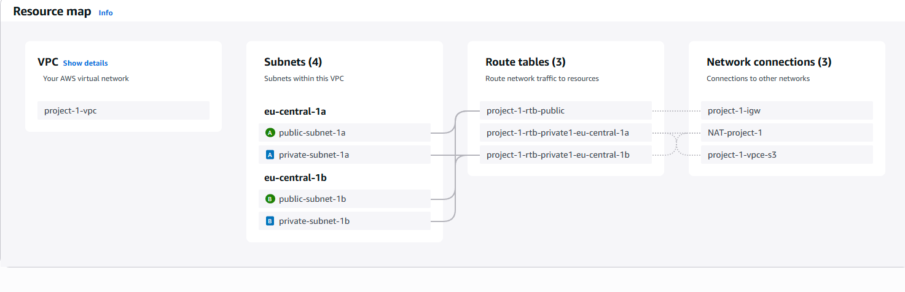

# AWS VPC Project – Multi-AZ with Public & Private Subnets

This is a small hands-on project I built while preparing for the **AWS Solutions Architect Associate** exam.

I wanted to move beyond theory and actually create a **custom network architecture** on AWS, so I set up a VPC with **public and private subnets across two Availability Zones**, routing, a NAT Gateway, and an Internet Gateway — all built manually in the AWS Console.

---

## What I Built

- **Custom VPC**: 10.0.0.0/16  
- **2 Availability Zones**: eu-central-1a, eu-central-1b  
- **4 Subnets** (two public, two private):  
  - Public: 10.0.0.0/20 (AZ a) and 10.0.16.0/20 (AZ b)  
  - Private: 10.0.32.0/20 (AZ a) and 10.0.48.0/20 (AZ b)  
- **Internet Gateway (IGW)** for public subnets  
- **NAT Gateway** in one public subnet (with Elastic IP) for outbound internet access from private subnets  
- **Route Tables** configured so:  
  - Public subnets route to IGW  
  - Private subnets route to NAT  

---

## Why I Built It

I’m using these mini-projects to **practice core AWS concepts** like VPC design, subnetting, routing, and cost management.  
This project helped me get more comfortable with:
- Splitting CIDR ranges across subnets and AZs  
- Understanding the difference between Internet Gateways and NAT Gateways  
- Setting up route tables for isolated vs. internet-facing resources  
- Cleaning up resources (especially NAT) to avoid unnecessary AWS charges  

---

## Architecture Diagram

---

## Context

This project is part of my **AWS Cloud portfolio** — small, focused projects to document my learning and show that I’m working with real environments, not just theory.

I deleted everything after testing to avoid charges, but the design and process remain documented here.

Follow my AWS journey on [LinkedIn](https://www.linkedin.com/in/ciro-riccio-a1a933197/).
